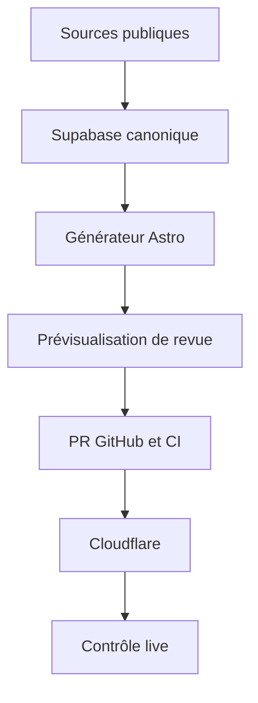

# SNY — Roadmap avant industrialisation du contenu

_Version 1.1 — 14 septembre 2026_  
_Périmètre : hub local d’affaires, chaîne éditoriale manuelle puis préparation du futur système distant._  
_Ce document complète le cadrage « sonde et exécuteur éditorial » du 12 septembre 2026. Il ne lance aucun développement._

## 0. Pilotage vivant

Ce fichier reste le document directeur jusqu’au démarrage formel du chantier exécuteur. Toute nouvelle idée doit être évaluée contre les portes ci-dessous ; elle ne change pas leur ordre sans décision explicite.

| Date | État | Preuve / décision | Prochaine action |
|---|---|---|---|
| 14 septembre 2026 | Récupération close | Le HTML source n’a été retrouvé ni sur le téléphone ni dans les espaces disponibles. | Recomposer une référence fidèle à partir de la vidéo et du texte. |
| 14 septembre 2026 | Porte 0 engagée | `SNY_Hub_Paris11_Reconstruction.html` créé comme référence visuelle autonome, `noindex`, explicitement non publiable. | Faire intégrer la référence et cette roadmap dans le dépôt réel par Opus. |
| 14 septembre 2026 | Mandat Opus étendu | `SNY_Prompt_Opus_Lancement_PreExecuteur.md` autorise désormais Opus à avancer seul sur les travaux locaux et réversibles des portes 0 à 4, même si une porte reste provisoire. Merge, déploiement, publication, mutation Supabase et exécuteur restent exclus. | Lancer Opus puis challenger ses preuves par porte et son verdict `READY_FOR_EXECUTOR_DESIGN` / `NOT_READY_FOR_EXECUTOR_DESIGN`. |
| 15 septembre 2026 | **Porte 0 PASSÉE** | Prototype intégré byte-identique (`sha256 a09fb67c…`) dans `prototypes/hubs/paris-11-v3-reconstruction/`, hors de toute surface publique, garde-fou automatique `scripts/qa/check-public-surface.mjs`. Branche `feat/hub-pre-executeur`. | Relire `GATE_0_REPORT.md` et trancher les 5 décisions regroupées. |
| 15 septembre 2026 | **Porte 2 PASSÉE** | Migration `004` appliquée, rejouée, testée (11 invariants) et rollback exercé sur un Postgres 17 éphémère. 4 fuites fermées, dont `fiabilite_info_10` expédié 52× au navigateur de chaque visiteur. | Appliquer `004` contre Supabase après relecture (décision d’Adrien). |
| 15 septembre 2026 | Portes 1, 3, 4 **PROVISOIRES** | 16 règles déterministes prouvées par 11 fixtures ; 3 hubs générés, hachés, `noindex`, **0/3 publiable** ; 4 cycles d’entretien simulés verts, idempotence prouvée aussi sur le corpus réel (65 → 0 nouvelle au 2ᵉ passage). | Revue juridique (porte 1) · retrait des 2 fiches en relaxe et fusion des 3 doublons (portes 3–4). |

**État des portes au 15 septembre 2026** : 0 `PASSED` · 1 `PROVISIONAL` · 2 `PASSED` ·
3 `PROVISIONAL` · 4 `PROVISIONAL`. Verdict de session : `READY_FOR_EXECUTOR_DESIGN` —
les contrats et exécuteurs locaux sont définis, **aucun hub n’est publiable**, et aucune
automatisation distante n’est autorisée. Détail et preuves : `GATE_0_REPORT.md`.

⚠️ **Écart le plus grave découvert** : deux fiches en `relaxe / non-lieu / classement`
(`FR-2026-0024`, `FR-2026-0035`) sont **toujours publiées sur la carte**, alors que les
mentions légales du site en production s’engagent à les retirer. Voir `CORPUS_AUDIT_V0.md` §2.1.

## 1. Décision directrice

Le système distant ne doit pas être le prochain chantier. Le prochain chantier est de rendre **la production manuelle déterministe, vérifiable et maintenable**.

Le bon ordre est :

1. figer un template public de référence ;
2. figer ce qu’est une donnée éditoriale acceptable ;
3. structurer les affaires, événements, affirmations et sources dans Supabase ;
4. prouver manuellement la création, la mise à jour, la correction et le retrait ;
5. seulement ensuite brancher le moteur de contrôle QGMC et Telegram.

Sinon, l’automatisation accélérera surtout la production de pages difficiles à maintenir, de dates périmées et d’incohérences.

## 2. État de récupération du prototype

### Conclusion

Le code HTML original n’apparaît ni dans le snapshot du dépôt fourni, ni dans les autres fichiers présents, ni dans l’historique de travail disponible. Le fichier Markdown joint contient le **texte rendu**, pas le HTML/CSS/JavaScript. La vidéo montre un fichier ouvert localement dans Chrome depuis WhatsApp.

L’adresse :

`content://com.whatsapp.provider.media/item/25686f60-84c2-4d10-9992-28720d3c8f41`

n’est pas une URL web et son UUID n’est pas un nom de fichier exploitable. C’est une URI fournie par WhatsApp à une autre application Android avec une permission locale et temporaire. Elle ne peut pas être ouverte depuis un autre appareil ou depuis le dépôt.

### Procédure de récupération, par ordre de probabilité

Avant tout : **ne pas fermer l’onglet Chrome encore ouvert, ne pas vider les données de Chrome/WhatsApp et ne pas désinstaller WhatsApp**.

1. Dans la conversation WhatsApp d’origine, ouvrir les informations du contact ou du groupe, puis **Médias, liens et documents → Documents**. Rechercher autour de la date d’envoi, ouvrir le document, puis utiliser **Partager** pour le copier dans Mes fichiers, Drive ou un e-mail.
2. Sur le Samsung, ouvrir **Mes fichiers → Documents** ou **Stockage interne**. Chercher `html`, `htm`, `hub` et `affaires`, puis trier par date. Vérifier notamment :
   - `Android/media/com.whatsapp/WhatsApp/Media/WhatsApp Documents/`
   - `Android/media/com.whatsapp/WhatsApp/Media/WhatsApp Documents/Sent/`
   - sur une ancienne installation Android : `WhatsApp/Media/WhatsApp Documents/`
3. Si le message existe mais affiche une icône de téléchargement, le retélécharger puis le partager immédiatement vers un emplacement durable.
4. Essayer l’export de la conversation **avec médias** ; le document peut être inclus s’il est toujours disponible localement.
5. Si seul l’onglet Chrome est encore vivant, tenter **Partager → Mes fichiers/Drive** depuis Chrome. En dernier recours, connecter le téléphone à un ordinateur, activer le débogage USB et inspecter l’onglet avec `chrome://inspect/#devices`. On peut alors copier le DOM rendu et parfois les ressources chargées. Ce secours peut reconstituer la page, mais pas garantir les octets du fichier original.

Si ces pistes échouent, le texte extrait et la vidéo suffisent pour recréer un prototype très proche et responsive, mais pas pour certifier qu’il s’agit du code source original.

## 3. Audit du MVP « Hub Affaires V3 »

### Ce qu’il faut conserver

- une page ancrée dans une zone locale claire ;
- une date de dernière vérification visible ;
- des cartes d’affaires lisibles et reliées à leurs sources ;
- la présomption d’innocence explicitée ;
- le suivi de la réponse des institutions, pas seulement des accusations ;
- une vue synthétique suffisamment forte pour servir de « golden master » graphique.

### Ce qui interdit de le publier en l’état aujourd’hui

Le prototype est daté du 9 juin 2026. Au 14 septembre 2026, les quatre échéances qu’il qualifiait de prochaines sont passées : 16 juin, 26 juin, 31 août et 1er septembre. Les verdicts, renvois ou autres suites doivent être recherchés avant réemploi. Les compteurs « 0 condamnation », « 2 procès en cours » et les statuts individuels ne peuvent donc plus être présumés exacts.

Il contient également plusieurs informations trop précises au regard de la doctrine SNY déjà définie : année de naissance ou âge exact d’une personne mise en cause, nombre exact d’enfants et âge exact d’un enfant. Même sans nom, ces détails augmentent la ré-identification possible et doivent être supprimés ou généralisés.

Autres écarts :

- l’étiquette interne « V3 — publiable en l’état », les coches de QA et « 85 % complété » sont mêlées à la page publique ; elles doivent vivre dans l’outil de revue ;
- le résumé cite « Voltaire » alors que la carte correspondante n’est pas nommée ainsi : la liaison affaire ↔ établissement doit être clarifiée ;
- les compteurs semblent saisis dans la page au lieu d’être calculés à partir d’enregistrements canoniques ;
- une même source de synthèse alimente de nombreuses affirmations : il faut lier chaque affirmation importante à son passage et à sa date de vérification ;
- les citations longues, podcasts, ressources et associations ont chacun leurs propres règles de sélection, de droits et de maintenance ; ils élargissent excessivement un premier périmètre industriel ;
- la vidéo révèle au moins un problème de mise en page mobile dans l’en-tête/navigation.

### Template public V1 recommandé

La première version industrielle doit être volontairement plus petite :

1. en-tête de zone, date de vérification et méthodologie ;
2. compteurs **calculés** depuis les données publiées ;
3. au moins quatre affaires distinctes et qualifiées, sans remplissage artificiel ;
4. statut actuel et chronologie factuelle de chaque affaire ;
5. réponses publiques/institutionnelles directement sourcées ;
6. liste des sources, procédure de correction et contact.

À reporter : citations de presse, podcasts, annuaire d’associations, agenda judiciaire public et pages individuelles d’affaires. L’agenda ne doit revenir qu’avec expiration automatique et blocage des dates dépassées.

## 4. Architecture cible avant la couche distante

Le hub n’est pas une nouvelle base de contenu. C’est un **rendu dérivé** de la base canonique.

Le modèle minimal à stabiliser avant Telegram :

| Entité | Rôle |
|---|---|
| `cases` | Identité durable de l’affaire, zone, établissement, état public courant |
| `case_events` | Événements datés et append-only : plainte, enquête, audience, décision, réponse institutionnelle |
| `sources` | URL canonique, éditeur, date, accessibilité, dernière vérification |
| `claims` | Affirmation publiable reliée à une ou plusieurs sources et au passage justificatif |
| `local_hubs` / `hub_cases` | Maille géographique et sélection explicite des affaires |
| `content_versions` | Payload rendu, hash, règles et template utilisés |
| `reviews` | Décision humaine, identité du validateur, date et hash exact validé |
| `releases` | Commit, déploiement, contrôle live, correction ou retrait éventuel |

La vue/export public doit fonctionner par liste blanche. Aucun `select=*`, commentaire interne, note de revue ou secret Supabase ne doit pouvoir rejoindre le dépôt ou le navigateur.

## 5. Roadmap à portes de sortie

Il ne faut pas passer à la phase suivante parce que du temps a été consacré à la précédente. Chaque phase se termine par une preuve observable.

| Porte | Travail à réaliser | Preuve nécessaire pour passer |
|---|---|---|
| **0 — Sauver la référence** | Récupérer le HTML ou reconstruire le V3 ; le placer dans Git avec captures desktop/mobile ; séparer les éléments QA du template public. | Un commit contient le prototype, ses assets et deux rendus de référence reproductibles. Aucun fichier de référence ne vit uniquement dans WhatsApp. |
| **1 — Contrat éditorial et juridique** | Définir champs autorisés/interdits, formulations par statut judiciaire, règle de datation, présomption d’innocence, minimisation, droit de correction/réponse, procédure de retrait ; faire relire le cadre par un conseil compétent en droit de la presse et données personnelles. | Une checklist permet à deux personnes différentes de rendre la même décision sur un corpus test incluant cas acceptable, ambigu, défavorable et à retirer. |
| **2 — Source de vérité** | Normaliser le modèle Supabase ; dédoublonner les 53 affaires existantes ; corriger dates/sources/coordonnées manquantes ; supprimer les exports internes ; relier les affirmations aux sources. | Le hub Paris 11 est généré uniquement depuis des fixtures/données structurées ; tous ses compteurs se recalculent ; zéro donnée interne dans l’export public. |
| **3 — Fabrique manuelle** | Construire le template Astro dynamique ; générer le dossier de revue et les rendus mobile/desktop ; publier via PR/CI ; contrôler le live ; documenter rollback. | Trois hubs complets, dont Paris 11, sont produits au même niveau de qualité par le même processus sans retouche directe du HTML généré. |
| **4 — Entretien prouvé** | Définir échéances par statut, priorité aux issues défavorables à la thèse initiale, détection des dates dépassées et liens morts ; tester correction, mise à jour transversale et retrait. | Deux cycles complets de maintenance sont réalisés manuellement, plus un exercice de correction/retrait. Aucune échéance passée ne reste présentée comme future. |
| **5 — Préparation distante** | Écrire les contrats d’actions, budgets, états terminaux, permissions Telegram, hashes et critères de rollback ; préparer le mode observation sans mutation. | Pour chaque action proposée existe déjà un exécuteur borné et testé. Chaque GO peut finir en succès, échec explicite ou rollback ; aucun second clic n’est requis après le GO. |

### Volume de preuve conseillé avant le système distant

- 1 template public figé ;
- 3 hubs produits manuellement, avec au moins 4 affaires distinctes chacun ;
- 2 cycles de maintenance complets ;
- 1 cas où une information nouvelle confirme la fiche ;
- 1 cas où elle l’infirme ou l’atténue ;
- 1 correction ou retrait simulé puis contrôlé en ligne ;
- 0 secret ou champ interne dans les sorties publiques ;
- 0 date future dépassée ;
- 100 % des affirmations sensibles reliées à une source vérifiable.

## 6. Les quatre missions à lancer avant QGMC distant

### Mission A — Référence et contrat

Récupérer/reconstruire Paris 11, retirer les éléments périmés ou trop précis, choisir les blocs V1 et figer la checklist éditoriale. C’est la mission la plus urgente.

### Mission B — Normalisation du corpus

Auditer les 53 affaires actuelles, créer les événements et affirmations sourcées, traiter les doublons et produire un export public strict. Cette mission transforme le contenu actuel en base exploitable.

### Mission C — Trois hubs en production manuelle

Produire Paris 11 puis deux hubs jumeaux avec le même template, la même revue et le même chemin GitHub → Cloudflare. Le but est de mesurer le vrai coût et de découvrir les exceptions avant de les coder dans une sonde.

### Mission D — Maintenance et correction

Faire tourner deux revues périodiques bornées, incluant prioritairement les audiences échues, décisions, classements, relaxes, non-lieux, corrections institutionnelles et liens morts. Prouver la mise à jour en cascade lorsqu’une affaire figure dans plusieurs agrégats.

## 7. Ce que la future couche distante reprendra de QGMC

Une fois les cinq portes franchies, la couche distante réutilisera :

- machine d’états et registre d’actions versionnées ;
- leases, idempotence, budgets et journal d’audit ;
- proposition Telegram dans un groupe partagé, validable par l’un des deux identifiants autorisés ;
- rendu complet et hashé **avant** le GO ;
- GO portant sur le payload exact, puis exécution autonome sans second clic pour l’action bornée ;
- PR, CI, merge, déploiement et contrôle live ;
- états terminaux explicites : succès, échec ou rollback ;
- `NO_ACTION` comme résultat sain lorsque rien ne mérite une intervention.

Trois premières actions seulement :

1. `LOCAL_AGGREGATE_CREATE@1.0.0` ;
2. `CASE_EVENT_APPLY@1.0.0` ;
3. `CASE_CORRECT_OR_UNPUBLISH@1.0.0`.

Les pages individuelles, l’indexation SEO, les changements de doctrine et les nouveaux blocs éditoriaux restent des décisions humaines hors boucle.

## 8. Critère final de démarrage

Le développement du système distant peut commencer lorsque cette phrase est vraie :

> Nous savons déjà produire, mettre à jour, corriger et retirer un hub manuellement à partir de données structurées, avec le même résultat entre opérateurs, et chaque étape de la future boucle dispose d’un contrat et d’un exécuteur testable.

Tant qu’elle est fausse, l’effort le plus rentable reste dans le modèle éditorial, la donnée canonique et l’entretien manuel.

## Références externes utiles

- Android, fonctionnement et permissions temporaires des `content://` : https://developer.android.com/reference/androidx/core/content/FileProvider
- Samsung, copie et déplacement avec Mes fichiers : https://www.samsung.com/us/support/answer/ANS10002531/
- Loi du 29 juillet 1881, article 29 : https://www.legifrance.gouv.fr/codes/article_lc/LEGIARTI000006419790/
- CNIL, droits numériques et garanties spécifiques pour les mineurs : https://www.cnil.fr/fr/enjeux-numeriques/les-droits-numeriques-des-mineurs
